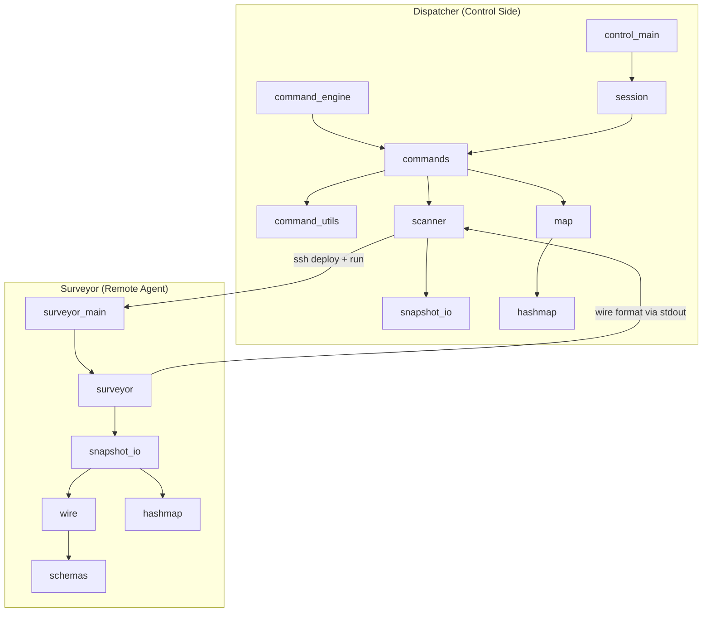
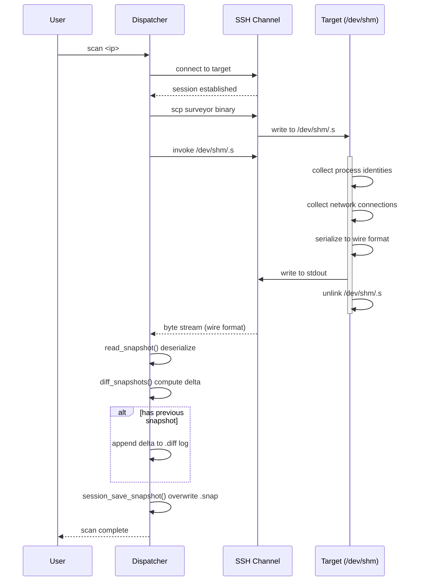

# Architecture document

## Overview
Topomap is a rapid deploy security auditing tool. The tool works by deploying surveyors on target machines through ssh to take a snapshot of `/proc` and stream the result back to a central host for analysis. The tool is designed for rapid deployment across many nodes without needing extra configurations.

## Components map

## Data flow narrative: Scanning a target
A scan begins when the user issues a `scan` command through the CLI. The command engine resolves the target against the enrolled node list in the session, retrieving the IP and credentials stored in `nodes.conf`.

The dispatcher opens an SSH channel to the target and writes the compiled surveyor binary directly into `/dev/shm`, a memory-backed filesystem chosen deliberately so the binary never touches persistent storage on the target. The binary is invoked immediately over the same channel.

On the target, the surveyor walks `/proc` collecting process identities: pid, ppid, loginuid, starttime, exe, cmdline, and cgroup. Additionally, for each process maps open socket inodes to network connections by parsing `/proc/net/tcp`, `/proc/net/udp`, and `/proc/net/unix`. The complete picture of the machine's process and network state is assembled into a `MachineSnapshot` in memory. The surveyor then serializes this structure to stdout using the wire engine, writing fixed fields through the schema descriptors and dynamic arrays explicitly. Once serialization is complete dispatcher deletes the binary from `/dev/shm` and close the connection.

The serialized byte stream travels back to the dispatcher through SSH's stdout capture. The dispatcher feeds this stream into `read_snapshot`, which reconstructs the `MachineSnapshot` in memory by walking the same schemas in reverse — validating magic and version headers first, then reading identity fields and allocating dynamic arrays for connections.

If the node has a previous snapshot, `diff_snapshots` compares the two and identify processes that appeared, disappeared, or changed their network connections between scans. The delta is appended to the node's diff log as a human-readable report with a UTC timestamp. Whether or not a diff exists, the new snapshot overwrites the previous `.snap` file via `session_save_snapshot`, becoming the baseline for the next scan.

## Component Descriptions

### Command Engine
An engine for creating commands for the dispatcher REPL. Commands are declared in `commands.c` and registered to the session on startup. Utitiliy functions that a command might need are declared in `command_util.c`.

### Wire Engine
Generic binary serialization engine. Schemas are defined as WireField 
tables in `schemas.c`. Adding a field to the wire format means adding 
one row to the relevant schema, nothing else. Dynamic arrays are handled explicitly in `snapshot_io.c` since they require malloc.
> The decision to adopt this engine approach was to account for future's needs of adding more data collection for the surveyor, or building a new surveyor that has different functions but still need to stream data back.

### Surveyor
The binary that scans a machine's `/proc` when run. Designed to be as light as possible for easy 
transport since it is statically compiled to avoid depending on the target's libraries. Since collecting process information across many `/proc` entries is trivially parallel, multiprocessing is used to shorten surveyor runtime, aiding in a reduction of footprint and time of presence on a potentially compromised target.

A hashmap is used to resolve which process owns which network connection from `/proc/net`. Each process's socket inodes are walked and looked up against two hashmaps: one for TCP/UDP connections, and one for Unix sockets. Each connection is classified as ingress, egress, local, or Unix in O(1) per lookup. This makes the full topology resolution linear in the total number of socket inodes across all processes rather than quadratic.